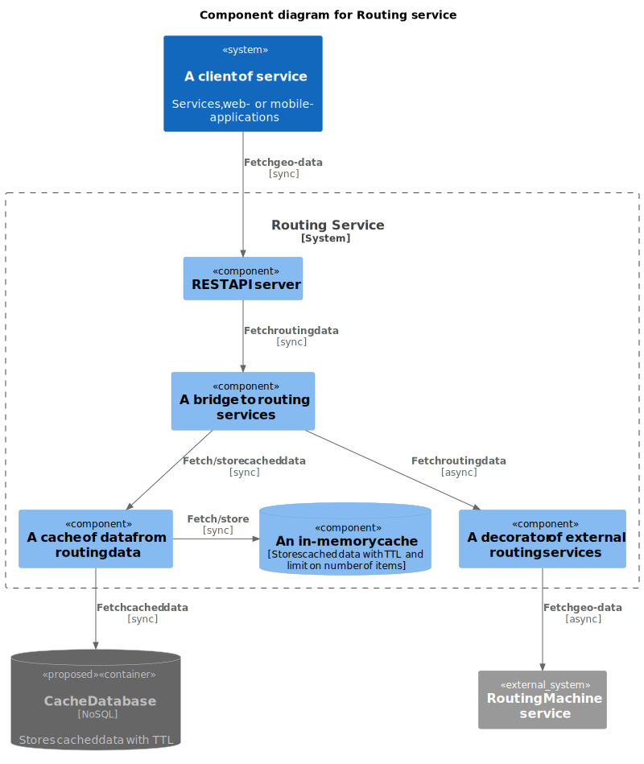

# Destination Measurement

A service is responsible for collecting information from 3rd party map-services and decorating it into internal domain model representation.

**Functional Requirements:**

1. Handles REST API requests with a list of geographic coordinates and orders these points by time to travel to them.
2. The service should support easy switsching to new services.

**Non-functional Requirements:**

1. Throttles requests to 3rd party map-services to align with their limits.
2. Response time should be less than 20 ms on average for a working day in a specific location.
3. Needs to respond with already known destinations even if 3rd party services are not available at the current moment.

# Architecture

